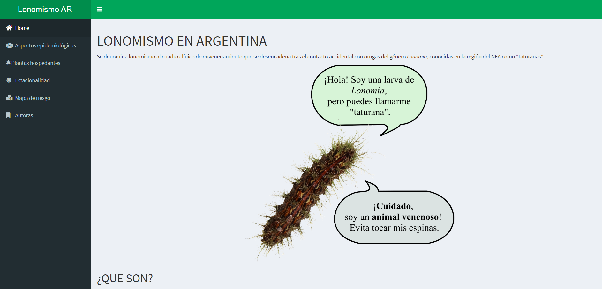

# Aplicación Shiny: Evaluación Eco-epidemiológica y Mapeo de Riesgo de Lonomismo en Misiones, Argentina



## Descripción

Esta aplicación Shiny fue creada para divulgar los resultados del estudio titulado ["A hidden deadly venomous insect: First eco-epidemiological assessment and risk mapping of lonomism in Argentina"](https://journals.plos.org/plosntds/article?id=10.1371/journal.pntd.0009542), publicado en PLOS Neglected Tropical Diseases. La aplicación está dirigida a profesionales de la salud, agentes sanitarios y tomadores de decisiones, con el objetivo de apoyar las acciones sobre el lonomismo en Misiones, Argentina.

## Autor

- **Marília Melo Favalesso** - *Ecoepidemiologista y Científica de Datos*

## Funcionalidades

- **Aspectos Epidemiológicos**: Visualización de datos epidemiológicos relacionados con el lonomismo.
- **Plantas Hospedantes**: Información sobre las plantas hospedantes de las larvas de Lonomia.
- **Estacionalidad**: Análisis estacional de la ocurrencia de lonomismo.
- **Mapa de Riesgo**: Mapa de riesgo de accidentes causados por Lonomia.
- **Tabla de Accidentes**: Número de accidentes por departamento en Misiones.

## Instalación

Para ejecutar esta aplicación localmente, siga los siguientes pasos:

1. Clone este repositorio:
    ```sh
    git clone https://github.com/mmfava/dashboard_lonomia_AR
    cd dashboard_lonomia_AR
    ```

2. Instale los paquetes necesarios:
    ```r
    install.packages(c("shinydashboard", "shiny", "png", "DT", "readr", "tidyverse", 
                       "raster", "leaflet", "slickR", "RColorBrewer", "kableExtra", 
                       "readxl", "formattable", "rgdal", "zoo", "htmlwidgets"))
    ```

3. Ejecute la aplicación:
    ```r
    library(shiny)
    shiny::runApp()
    ```

## Uso

La aplicación está estructurada en varias pestañas:

- **Inicio**: Información general sobre la aplicación.
- **Aspectos Epidemiológicos**: Gráficos sobre la distribución de casos según sexo, edad, zona, hora del día, circunstancias y parte del cuerpo afectada.
- **Plantas Hospedantes**: Tabla de las plantas hospedantes de Lonomia.
- **Estacionalidad**: Análisis gráfico de la estacionalidad de los casos.
- **Mapa de Riesgo**: Mapa interactivo mostrando las áreas de riesgo de lonomismo.
- **Número de Accidentes**: Tabla del número de accidentes por departamento en Misiones.

Puede acceder a la aplicación en línea [aquí](https://mmfavalesso.shinyapps.io/lonomismoar/).

## Contribución

Si desea contribuir a este proyecto, por favor siga los siguientes pasos:

1. Haga un fork del repositorio.
2. Cree una nueva rama (`git checkout -b feature/nueva-funcionalidad`).
3. Haga commit de sus cambios (`git commit -m 'Añadir nueva funcionalidad'`).
4. Haga push a la rama (`git push origin feature/nueva-funcionalidad`).
5. Cree un nuevo Pull Request.

## Licencia

Este proyecto está licenciado bajo los términos de la Licencia MIT.